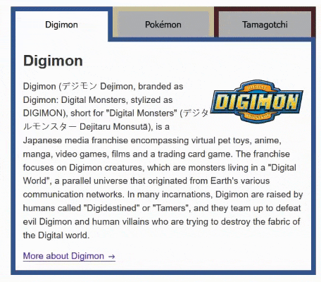

# Tabby Component Project
## Overview
The Tabby Component Project is a simple, yet interactive, React application that showcases the use of tabs to display different sets of content. The application features three tabs, each representing a popular franchise: Digimon, Pokémon, and Tamagotchi. When a tab is selected, the corresponding content for that franchise is displayed, providing a seamless user experience.

## Features
Tabbed Interface: The application uses a tabbed interface to organize content. This allows users to easily navigate between different sets of content.

Interactive UI: The application provides visual feedback to the user by highlighting the active tab. This makes it easy for users to understand which tab's content is currently being displayed.

Responsive Design: The application is designed to be responsive and can adapt to different screen sizes. This ensures a consistent user experience across different devices.

> [Live Demo Link](https://fmanimashaun.github.io/tabby-component/)

## Demo

## Installation
To install and run this project locally, you'll need to have Node.js and npm installed. Follow these steps:

Clone the repository: `git clone https://github.com/fmanimashaun/tabby-component.git
Navigate to the project folder: `cd tabby-component`
Install the dependencies: `npm install`
Start the project: `npm start`

## Author

👤 **Engr. Animashaun Fisayo**

- [GitHub](https://github.com/fmanimashaun)
- [Twitter](https://twitter.com/fmanimashaun)
- [LinkedIn](https://www.linkedin.com/in/fmanimashaun/)
- [Website](https://fmanimashaun.com)
## Contributing
We welcome contributions from the community. If you'd like to contribute, please fork the repository and make your changes, then open a pull request to propose your changes.

## License
This project is licensed under the MIT License. See the LICENSE file for details.